# System Architecture & Technical Specification

## 1. Executive Summary

This platform is a multi-tenant SaaS Business Intelligence (BI) and analytics solution engineered specifically for Bangladeshi e-commerce merchants. The platform connects directly to merchant storefronts (WooCommerce, Shopify) and Bangladeshi logistics couriers (Pathao, Steadfast, RedX), ingesting real-time orders, tracking delivery life cycles, normalizing status across disparate logistics providers, and delivering AI-powered actionable analytics with natural-language querying.

Target Currency: **BDT (৳)**  
Target Geography: **Bangladesh (Dhaka, Chittagong, Sylhet, Rajshahi, etc.)**  
Primary User Interface: **English (with Bangla localized support and docs)**

---

## 2. High-Level Architecture Diagram

```mermaid
flowchart TB
    subgraph Client Layer
        Web["Next.js 15 Web Application\n(App Router / Server Components / Tailwind / shadcn)"]
        MobileWeb["Mobile Web Responsive View\n(Optimized for Merchant Smartphones)"]
    end

    subgraph Security & Ingress
        VercelEdge["Vercel Edge Network / API Gateway"]
        AuthMiddleware["Supabase Auth & Tenant Context Middleware"]
    end

    subgraph Application Core ["Modular Monolith (/src/modules)"]
        ModTenants["tenants\n(Workspaces, Team, Roles)"]
        ModIntegrations["integrations\n(WooCommerce, Shopify, Couriers)"]
        ModOrders["orders\n(Tracking, Normalizer, History)"]
        ModAnalytics["analytics\n(SQL KPI Aggregation, Cashflow)"]
        ModAI["ai\n(NL Query, Anomaly Detection, Forecasts)"]
        ModBilling["billing\n(SSLCommerz, Subscriptions, Usage)"]
    end

    subgraph Background Processing
        InngestQueue["Inngest Event Bus & Workflow Orchestrator\n(Tenant-Keyed Concurrency)"]
        JobOrderSync["Order Ingestion Job"]
        JobCourierPoll["Courier Status Poller & Webhook Handler"]
        JobAnomaly["Daily Anomaly Detection Cron"]
        JobForecast["Weekly Forecast Generator"]
    end

    subgraph Data & Storage Layer
        SupabasePG[("PostgreSQL Database (Supabase)\n+ Row-Level Security (RLS)\n+ Connection Pooling (pgBouncer)")]
        PrismaORM["Prisma ORM (Strict TypeScript Models)"]
        AICache[("ai_cache & token_usage Tables")]
    end

    subgraph External Services
        WooCommerce["WooCommerce REST API v3"]
        Shopify["Shopify GraphQL & Webhooks"]
        Couriers["Pathao | Steadfast | RedX\n(Webhooks & Polling APIs)"]
        OpenAI["OpenAI API\n(Luna / Terra Models)"]
        SSLCommerz["SSLCommerz Payment Gateway"]
    end

    Web --> VercelEdge
    MobileWeb --> VercelEdge
    VercelEdge --> AuthMiddleware
    AuthMiddleware --> ApplicationCore

    ModIntegrations --> InngestQueue
    InngestQueue --> JobOrderSync
    InngestQueue --> JobCourierPoll
    InngestQueue --> JobAnomaly
    InngestQueue --> JobForecast

    JobOrderSync --> ModOrders
    JobCourierPoll --> ModOrders

    ModOrders --> PrismaORM
    ModAnalytics --> PrismaORM
    ModTenants --> PrismaORM
    ModBilling --> PrismaORM
    ModAI --> AICache
    ModAI --> OpenAI

    PrismaORM --> SupabasePG

    ModIntegrations --> WooCommerce
    ModIntegrations --> Shopify
    ModIntegrations --> Couriers
    ModBilling --> SSLCommerz
```



---

## 3. Domain Modules & Boundary Isolation

The codebase is organized by business capability inside `/src/modules/`. Cross-module imports must pass strictly through the public API contract exported by each module's `index.ts`. Direct deep imports into private internal files of other modules are forbidden.

### Standard Module Layout
```
/src/modules/<domain>/
  ├── index.ts               # Public API surface (types, schemas, exported services)
  ├── <domain>.service.ts    # Business logic & domain workflows
  ├── <domain>.repository.ts # Database access via Prisma
  ├── <domain>.schema.ts     # Zod input/output schemas
  ├── <domain>.types.ts      # Domain interfaces & TypeScript types
  └── README.md              # Domain documentation, contracts, and data flows
```

### Module Responsibilities

1. **`tenants` Module (`/src/modules/tenants`)**
   - Tenant creation, workspace settings, team member invitations, role management (`OWNER`, `ADMIN`, `MEMBER`).
   - Tenant context resolution from Supabase Auth session JWT.

2. **`integrations` Module (`/src/modules/integrations`)**
   - Store connectors:
     - **WooCommerce**: REST API v3 connector using consumer key/secret with per-store webhook registration.
     - **Shopify**: OAuth 2.0 flow, token exchange, and HMAC-verified webhook listeners.
   - Courier connectors:
     - **Pathao**: API client, webhook receiver, tracking parser.
     - **Steadfast**: API client, webhook receiver, parcel status polling.
     - **RedX**: API client, tracking polling, webhook receiver.
   - Credential encryption: Sensitive secrets stored securely and decrypted only in runtime memory.

3. **`orders` Module (`/src/modules/orders`)**
   - Unified order ingestion and canonical order representation.
   - Status normalization engine transforming courier-specific states into `NormalizedOrderStatus`.
   - Audit trail in `OrderStatusHistory` for every state change.
   - Filtering, search, and pagination for merchants.

4. **`analytics` Module (`/src/modules/analytics`)**
   - **SQL-First Aggregations**: KPI calculations (Total Revenue, AOV, Delivery Rate, Return Rate, COD Conversion Rate, Net Cash Inflow) executed via optimized SQL queries.
   - Trend analysis by courier, city/district (Dhaka vs Outside Dhaka), and sales channel.
   - Zero LLM usage for standard numerical math.

5. **`ai` Module (`/src/modules/ai`)**
   - Natural language query interface: Translates merchant inquiries ("Why did return rate rise in Chittagong last week?") into safe structured analytics queries.
   - Automated anomaly detection: Daily background job scanning for sudden drop-offs in delivery success or spikes in returns.
   - Weekly sales forecasting per tenant based on historical sales velocity.
   - **Cost Control Guardrails**:
     - Response caching in `ai_cache` keyed by `sha256(tenantId + prompt + contextHash)` with configurable TTL.
     - Strict daily token meter capped at 100,000 tokens/day per tenant (configurable by subscription tier).

6. **`billing` Module (`/src/modules/billing`)**
   - Subscription tier management (`FREE`, `PRO`, `BUSINESS`).
   - Usage quotas (connected stores, monthly order volume, AI queries).
   - Integration with SSLCommerz payment gateway for subscription fee collection (no direct fund handling).

---

## 4. Multi-Tenant Isolation & Security Model

1. **Tenant Identification**
   - Every database table (except global system lookup tables) contains a `tenantId UUID` foreign key referencing the `Tenant` table.
   - All tenant queries are strictly filtered by `tenantId`.

2. **Supabase Row Level Security (RLS)**
   - RLS is enabled on 100% of tenant-facing tables.
   - Tenant context is extracted directly from the authenticated user's JWT claims (`auth.jwt() -> app_metadata -> tenant_id`).
   - RLS policies ensure cross-tenant data leakage is cryptographically impossible at the database engine level, even if application logic has a bug.

3. **Background Job Tenant Context**
   - Background jobs receive `tenantId` in the event payload.
   - The job runner instantiates a scoped database context that enforces `tenantId` validation before any mutation or read occurs.

---

## 5. Courier Status Normalization Specification

Bangladeshi couriers use divergent terminology for parcel statuses. The platform normalizes all courier events into `NormalizedOrderStatus`:

```typescript
export enum NormalizedOrderStatus {
  PROCESSING = 'processing',
  SHIPPED = 'shipped',
  ON_THE_WAY = 'on_the_way',
  DELIVERED = 'delivered',
  PARTIAL = 'partial',
  RETURN = 'return',
  EXCHANGE = 'exchange',
  CANCELLED = 'cancelled',
}
```

### Courier Mapping Rules

| Normalized Status | Pathao Status | Steadfast Status | RedX Status |
| :--- | :--- | :--- | :--- |
| `PROCESSING` | `Pickup_Requested`, `Pending` | `in_review`, `pending` | `pickup-requested`, `ready-for-pickup` |
| `SHIPPED` | `Assigned_For_Pickup`, `Picked` | `picked` | `picked-up` |
| `ON_THE_WAY` | `In_Transit`, `At_Sorting_Hub` | `in_transit`, `dispatched` | `in-transit`, `reached-destination-hub` |
| `DELIVERED` | `Delivered` | `delivered` | `delivered` |
| `PARTIAL` | `Partial_Delivered` | `partial_delivered` | `partial-delivered` |
| `RETURN` | `Return`, `Returned_To_Merchant` | `returned`, `cancelled_and_returned` | `returned-to-origin`, `cancelled` |
| `EXCHANGE` | `Exchange` | `exchange_pending` | `exchange-delivered` |
| `CANCELLED` | `Cancelled` | `cancelled` | `pickup-cancelled` |

Each connector implements `mapStatus(raw: string): NormalizedOrderStatus`. Both the raw status string and normalized enum are persisted in the database.

---

## 6. Background Job Architecture (Inngest)

All heavy, slow, or recurring operations run through Inngest workflows.

- **Tenant-Level Concurrency**: Concurrency is limited per tenant (e.g. `concurrency: { limit: 5, key: 'event.data.tenantId' }`) to prevent any single merchant from starving system resources.
- **Idempotency**: All job runs are keyed by unique event IDs or order IDs (`upsert` semantics used in database writes).
- **Retries**: Configured with exponential backoff (default: 3 retries) and dead-letter event logging.

---

## 7. AI Cost Discipline & Guardrails

To ensure financial sustainability:
- **No LLM for Standard Calculations**: All KPIs (AOV, return rates, COD reconciliation) are computed using optimized PostgreSQL queries.
- **Model Tiers**: Strictly use cost-efficient models (e.g., `gpt-4o-mini` or equivalent high-efficiency tier) for data classification and natural language queries.
- **Prompt Hash Caching**: Hashes of user questions and serialized context are stored in `ai_cache` with a 24-hour TTL. Duplicate questions serve cached responses with zero OpenAI token cost.
- **Daily Budget Cap**: Rate limiter blocks AI requests once a tenant reaches their daily token allowance (100,000 tokens for Free/Pro).

---

## 8. Technology Stack Summary

| Layer | Technology |
| :--- | :--- |
| **Framework** | Next.js 15+ (App Router, React Server Components) |
| **Language** | TypeScript (Strict mode enabled, no implicit any) |
| **Database** | PostgreSQL on Supabase + Prisma ORM |
| **Authentication** | Supabase Auth (Multi-tenant with RLS integration) |
| **Job Queue** | Inngest (Serverless, TypeScript SDK) |
| **Styling & UI** | Tailwind CSS + shadcn/ui + Lucide Icons |
| **Charts** | Recharts |
| **Validation** | Zod (All API routes and external payloads) |
| **Testing** | Vitest (Unit & Integration) + Playwright (E2E) |
| **Hosting** | Vercel (Frontend & Serverless API) + Supabase (DB & Auth) |
