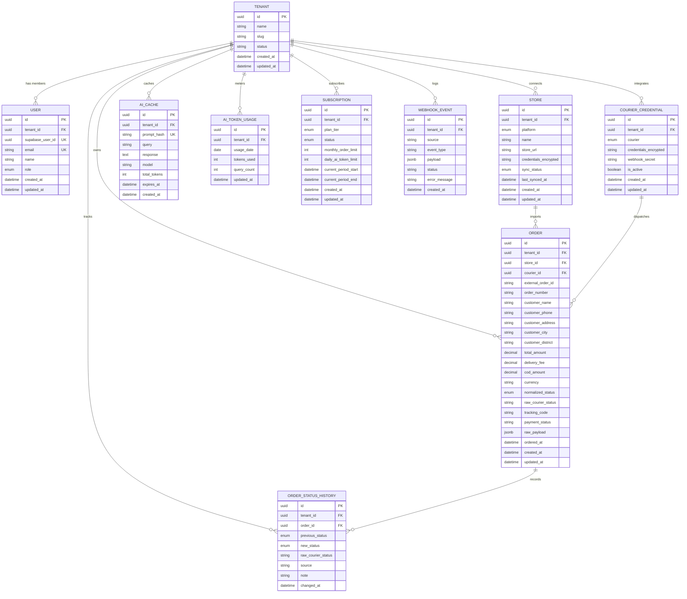

# Data Model & Database Architecture

## 1. Overview

The data architecture is designed for multi-tenant isolation, high read/write throughput for e-commerce order ingestion, strict auditability, and optimal query performance for analytical aggregations.

PostgreSQL (hosted on Supabase) serves as the primary relational database, accessed through Prisma ORM with strict TypeScript typing. Connection pooling is managed via Supabase pgBouncer for serverless scalability.

---

## 2. Entity-Relationship Diagram



---

## 3. Initial Prisma Schema (`prisma/schema.prisma`)

```prisma
datasource db {
  provider  = "postgresql"
  url       = env("DATABASE_URL")
  directUrl = env("DIRECT_URL")
}

generator client {
  provider = "prisma-client-js"
}

enum TenantRole {
  OWNER
  ADMIN
  MEMBER
}

enum StorePlatform {
  WOOCOMMERCE
  SHOPIFY
}

enum CourierProvider {
  PATHAO
  STEADFAST
  REDX
}

enum NormalizedOrderStatus {
  processing
  shipped
  on_the_way
  delivered
  partial
  return
  exchange
  cancelled
}

enum SyncStatus {
  IDLE
  SYNCING
  SUCCESS
  FAILED
}

enum PlanTier {
  FREE
  PRO
  BUSINESS
}

enum SubscriptionStatus {
  ACTIVE
  PAST_DUE
  CANCELLED
  TRIALING
}

enum WebhookStatus {
  PENDING
  PROCESSED
  FAILED
}

model Tenant {
  id        String   @id @default(dbgenerated("gen_random_uuid()")) @db.Uuid
  name      String   @db.VarChar(255)
  slug      String   @unique @db.VarChar(100)
  status    String   @default("active") @db.VarChar(50)
  createdAt DateTime @default(now()) @map("created_at") @db.Timestamptz
  updatedAt DateTime @updatedAt @map("updated_at") @db.Timestamptz

  users               User[]
  stores              Store[]
  courierCredentials  CourierCredential[]
  orders              Order[]
  orderStatusHistory  OrderStatusHistory[]
  aiCache             AiCache[]
  aiTokenUsage        AiTokenUsage[]
  subscriptions       Subscription[]
  webhookEvents       WebhookEvent[]

  @@map("tenants")
}

model User {
  id             String     @id @default(dbgenerated("gen_random_uuid()")) @db.Uuid
  tenantId       String     @map("tenant_id") @db.Uuid
  supabaseUserId String     @unique @map("supabase_user_id") @db.Uuid
  email          String     @unique @db.VarChar(255)
  name           String     @db.VarChar(255)
  role           TenantRole @default(MEMBER)
  createdAt      DateTime   @default(now()) @map("created_at") @db.Timestamptz
  updatedAt      DateTime   @updatedAt @map("updated_at") @db.Timestamptz

  tenant Tenant @relation(fields: [tenantId], references: [id], onDelete: Cascade)

  @@index([tenantId])
  @@index([email])
  @@map("users")
}

model Store {
  id                   String        @id @default(dbgenerated("gen_random_uuid()")) @db.Uuid
  tenantId             String        @map("tenant_id") @db.Uuid
  platform             StorePlatform
  name                 String        @db.VarChar(255)
  storeUrl             String        @map("store_url") @db.VarChar(500)
  credentialsEncrypted String        @map("credentials_encrypted") @db.Text
  syncStatus           SyncStatus    @default(IDLE) @map("sync_status")
  lastSyncedAt         DateTime?     @map("last_synced_at") @db.Timestamptz
  createdAt            DateTime      @default(now()) @map("created_at") @db.Timestamptz
  updatedAt            DateTime      @updatedAt @map("updated_at") @db.Timestamptz

  tenant Tenant  @relation(fields: [tenantId], references: [id], onDelete: Cascade)
  orders Order[]

  @@unique([tenantId, storeUrl])
  @@index([tenantId])
  @@map("stores")
}

model CourierCredential {
  id                   String          @id @default(dbgenerated("gen_random_uuid()")) @db.Uuid
  tenantId             String          @map("tenant_id") @db.Uuid
  courier              CourierProvider
  credentialsEncrypted String          @map("credentials_encrypted") @db.Text
  webhookSecret        String?         @map("webhook_secret") @db.VarChar(255)
  isActive             Boolean         @default(true) @map("is_active")
  createdAt            DateTime        @default(now()) @map("created_at") @db.Timestamptz
  updatedAt            DateTime        @updatedAt @map("updated_at") @db.Timestamptz

  tenant Tenant  @relation(fields: [tenantId], references: [id], onDelete: Cascade)
  orders Order[]

  @@unique([tenantId, courier])
  @@index([tenantId])
  @@map("courier_credentials")
}

model Order {
  id                  String                @id @default(dbgenerated("gen_random_uuid()")) @db.Uuid
  tenantId            String                @map("tenant_id") @db.Uuid
  storeId             String                @map("store_id") @db.Uuid
  courierId           String?               @map("courier_id") @db.Uuid
  externalOrderId     String                @map("external_order_id") @db.VarChar(255)
  orderNumber         String                @map("order_number") @db.VarChar(100)
  customerName        String                @map("customer_name") @db.VarChar(255)
  customerPhone       String                @map("customer_phone") @db.VarChar(50)
  customerAddress     String                @map("customer_address") @db.Text
  customerCity        String                @map("customer_city") @db.VarChar(100)
  customerDistrict    String                @map("customer_district") @db.VarChar(100)
  totalAmount         Decimal               @map("total_amount") @db.Decimal(12, 2)
  deliveryFee         Decimal               @default(0.00) @map("delivery_fee") @db.Decimal(10, 2)
  codAmount           Decimal               @default(0.00) @map("cod_amount") @db.Decimal(12, 2)
  currency            String                @default("BDT") @db.VarChar(10)
  normalizedStatus    NormalizedOrderStatus @default(processing) @map("normalized_status")
  rawCourierStatus    String?               @map("raw_courier_status") @db.VarChar(100)
  trackingCode        String?               @map("tracking_code") @db.VarChar(100)
  paymentStatus       String                @default("unpaid") @map("payment_status") @db.VarChar(50)
  rawPayload          Json?                 @map("raw_payload")
  orderedAt           DateTime              @map("ordered_at") @db.Timestamptz
  createdAt           DateTime              @default(now()) @map("created_at") @db.Timestamptz
  updatedAt           DateTime              @updatedAt @map("updated_at") @db.Timestamptz

  tenant            Tenant               @relation(fields: [tenantId], references: [id], onDelete: Cascade)
  store             Store                @relation(fields: [storeId], references: [id], onDelete: Cascade)
  courierCredential CourierCredential?   @relation(fields: [courierId], references: [id], onDelete: SetNull)
  statusHistory     OrderStatusHistory[]

  @@unique([tenantId, storeId, externalOrderId])
  @@index([tenantId, normalizedStatus])
  @@index([tenantId, orderedAt])
  @@index([tenantId, trackingCode])
  @@index([tenantId, customerPhone])
  @@index([tenantId, customerDistrict])
  @@map("orders")
}

model OrderStatusHistory {
  id               String                 @id @default(dbgenerated("gen_random_uuid()")) @db.Uuid
  tenantId         String                 @map("tenant_id") @db.Uuid
  orderId          String                 @map("order_id") @db.Uuid
  previousStatus   NormalizedOrderStatus? @map("previous_status")
  newStatus        NormalizedOrderStatus  @map("new_status")
  rawCourierStatus String?                @map("raw_courier_status") @db.VarChar(100)
  source           String                 @db.VarChar(100)
  note             String?                @db.Text
  changedAt        DateTime               @default(now()) @map("changed_at") @db.Timestamptz

  tenant Tenant @relation(fields: [tenantId], references: [id], onDelete: Cascade)
  order  Order  @relation(fields: [orderId], references: [id], onDelete: Cascade)

  @@index([tenantId, orderId])
  @@index([tenantId, changedAt])
  @@map("order_status_history")
}

model AiCache {
  id           String   @id @default(dbgenerated("gen_random_uuid()")) @db.Uuid
  tenantId     String   @map("tenant_id") @db.Uuid
  promptHash   String   @map("prompt_hash") @db.VarChar(64)
  query        String   @db.Text
  response     String   @db.Text
  model        String   @db.VarChar(50)
  totalTokens  Int      @map("total_tokens")
  expiresAt    DateTime @map("expires_at") @db.Timestamptz
  createdAt    DateTime @default(now()) @map("created_at") @db.Timestamptz

  tenant Tenant @relation(fields: [tenantId], references: [id], onDelete: Cascade)

  @@unique([tenantId, promptHash])
  @@index([tenantId, expiresAt])
  @@map("ai_cache")
}

model AiTokenUsage {
  id         String   @id @default(dbgenerated("gen_random_uuid()")) @db.Uuid
  tenantId   String   @map("tenant_id") @db.Uuid
  usageDate  DateTime @map("usage_date") @db.Date
  tokensUsed Int      @default(0) @map("tokens_used")
  queryCount Int      @default(0) @map("query_count")
  createdAt  DateTime @default(now()) @map("created_at") @db.Timestamptz
  updatedAt  DateTime @updatedAt @map("updated_at") @db.Timestamptz

  tenant Tenant @relation(fields: [tenantId], references: [id], onDelete: Cascade)

  @@unique([tenantId, usageDate])
  @@index([tenantId, usageDate])
  @@map("ai_token_usage")
}

model Subscription {
  id                  String             @id @default(dbgenerated("gen_random_uuid()")) @db.Uuid
  tenantId            String             @map("tenant_id") @db.Uuid
  planTier            PlanTier           @default(FREE) @map("plan_tier")
  status              SubscriptionStatus @default(ACTIVE)
  monthlyOrderLimit   Int                @default(200) @map("monthly_order_limit")
  dailyAiTokenLimit   Int                @default(100000) @map("daily_ai_token_limit")
  currentPeriodStart  DateTime           @default(now()) @map("current_period_start") @db.Timestamptz
  currentPeriodEnd    DateTime           @map("current_period_end") @db.Timestamptz
  createdAt           DateTime           @default(now()) @map("created_at") @db.Timestamptz
  updatedAt           DateTime           @updatedAt @map("updated_at") @db.Timestamptz

  tenant Tenant @relation(fields: [tenantId], references: [id], onDelete: Cascade)

  @@index([tenantId, status])
  @@map("subscriptions")
}

model WebhookEvent {
  id           String        @id @default(dbgenerated("gen_random_uuid()")) @db.Uuid
  tenantId     String        @map("tenant_id") @db.Uuid
  source       String        @db.VarChar(50)
  eventType    String        @map("event_type") @db.VarChar(100)
  payload      Json
  status       WebhookStatus @default(PENDING)
  errorMessage String?       @map("error_message") @db.Text
  createdAt    DateTime      @default(now()) @map("created_at") @db.Timestamptz

  tenant Tenant @relation(fields: [tenantId], references: [id], onDelete: Cascade)

  @@index([tenantId, source, status])
  @@map("webhook_events")
}
```

---

## 4. Supabase Row Level Security (RLS) Strategy

Every table contains a `tenant_id` foreign key. The RLS policies leverage the authenticated user's JWT metadata claim `app_metadata.tenant_id` or query the `users` lookup table.

### Example Database RLS Migration SQL:
```sql
-- Enable RLS on all tenant-facing tables
ALTER TABLE tenants ENABLE ROW LEVEL SECURITY;
ALTER TABLE users ENABLE ROW LEVEL SECURITY;
ALTER TABLE stores ENABLE ROW LEVEL SECURITY;
ALTER TABLE courier_credentials ENABLE ROW LEVEL SECURITY;
ALTER TABLE orders ENABLE ROW LEVEL SECURITY;
ALTER TABLE order_status_history ENABLE ROW LEVEL SECURITY;
ALTER TABLE ai_cache ENABLE ROW LEVEL SECURITY;
ALTER TABLE ai_token_usage ENABLE ROW LEVEL SECURITY;
ALTER TABLE subscriptions ENABLE ROW LEVEL SECURITY;
ALTER TABLE webhook_events ENABLE ROW LEVEL SECURITY;

-- Helper function to extract current tenantId from Supabase Auth JWT
CREATE OR REPLACE FUNCTION current_tenant_id() 
RETURNS UUID AS $$
  SELECT NULLIF(current_setting('request.jwt.claims', true)::jsonb -> 'app_metadata' ->> 'tenant_id', '')::uuid;
$$ LANGUAGE sql STABLE;

-- Generic tenant isolation policy pattern for Orders
CREATE POLICY tenant_isolation_orders ON orders
  FOR ALL
  USING (tenant_id = current_tenant_id())
  WITH CHECK (tenant_id = current_tenant_id());
```

---

## 5. Scalability & Performance Guardrails

1. **Composite Indexes for Common Filtering**:
   - `(tenant_id, normalized_status)`: Accelerates dashboard order status tabs (e.g., viewing all `return` orders).
   - `(tenant_id, ordered_at)`: Optimizes time-series analytics and date-range filtering.
   - `(tenant_id, tracking_code)`: Enables instantaneous courier webhook tracking lookups.
   - `(tenant_id, customer_phone)`: Allows quick customer history inspection.

2. **Decimals for Financial Accuracy**:
   - All amounts (`total_amount`, `delivery_fee`, `cod_amount`) use PostgreSQL `DECIMAL(12, 2)` or `DECIMAL(10, 2)` to eliminate floating-point rounding errors.

3. **Secrets Encryption**:
   - Store credentials (`credentials_encrypted`) and courier API keys are encrypted at rest using AES-256-GCM before storage.
