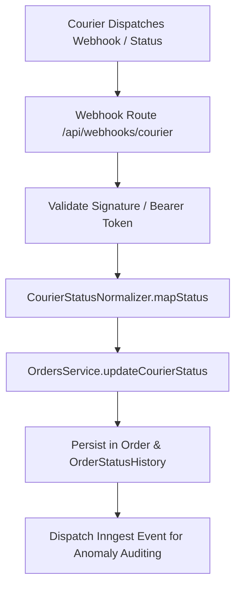

# Integrations Guide: Couriers & E-Commerce Platforms

This guide provides technical specifications and step-by-step instructions for engineers adding new e-commerce storefronts or Bangladeshi courier logistics providers to the SaaS BI platform.

---

## 1. Architectural Principles for Integrations

1. **Canonical Normalization**: Storefronts and couriers speak different dialects. The platform normalizes all disparate events into `NormalizedOrderStatus`.
2. **Dual Status Persistence**: Always persist both the canonical `NormalizedOrderStatus` and the courier's `rawCourierStatus` for audit fidelity.
3. **Encrypted at Rest**: All API tokens, secrets, and credentials must be encrypted using AES-256-GCM before saving into `courier_credentials` or `stores`.
4. **Idempotent Ingestion**: All webhook receivers and polling jobs must be idempotent. Webhook deliveries may arrive out-of-order or duplicate.
5. **Tenant Isolation**: Every integration credential and order entity must be bounded to `tenantId`.

---

## 2. Adding a New Courier Provider (e.g., eCourier, Paperfly)

To integrate a new logistics provider (e.g., `ECOURIER` or `PAPERFLY`), follow these 5 steps:



### Step 1: Update the Courier Enum in Prisma Schema

In `prisma/schema.prisma`, add the new courier to the `CourierName` enum:

```prisma
enum CourierName {
  PATHAO
  STEADFAST
  REDX
  ECOURIER    // New courier
  PAPERFLY    // New courier
}
```

Run migration:
```bash
npx prisma db push # or npx prisma migrate dev --name add_ecourier
```

### Step 2: Implement Status Normalization Mapping

In `src/modules/integrations/couriers/status-normalizer.ts`:

1. Define the raw status mapping dictionary.
2. Update `CourierStatusNormalizer.mapStatus`.

```typescript
const ECOURIER_STATUS_MAP: Record<string, NormalizedOrderStatus> = {
  'Order Placed': NormalizedOrderStatus.PROCESSING,
  'Picked': NormalizedOrderStatus.SHIPPED,
  'In Transit': NormalizedOrderStatus.ON_THE_WAY,
  'Out for Delivery': NormalizedOrderStatus.ON_THE_WAY,
  'Delivered': NormalizedOrderStatus.DELIVERED,
  'Partial Delivered': NormalizedOrderStatus.PARTIAL,
  'Returned': NormalizedOrderStatus.RETURN,
  'Cancelled': NormalizedOrderStatus.CANCELLED,
};

// In CourierStatusNormalizer:
case 'ECOURIER': {
  return ECOURIER_STATUS_MAP[rawStatus] ?? NormalizedOrderStatus.PROCESSING;
}
```

### Step 3: Implement Webhook Endpoint

Create `src/app/api/webhooks/ecourier/route.ts`:

```typescript
import { NextRequest, NextResponse } from 'next/server';
import { ordersService } from '@/modules/orders';
import { CourierStatusNormalizer } from '@/modules/integrations/couriers/status-normalizer';
import { logger } from '@/lib/logger';
import { prisma } from '@/lib/prisma';
import { decryptCredential } from '@/lib/encryption';

export async function POST(request: NextRequest) {
  try {
    const payload = await request.json();
    const { tracking_id, status, tenant_id } = payload;

    // 1. Verify credentials / HMAC
    const cred = await prisma.courierCredential.findFirst({
      where: { tenantId: tenant_id, courierName: 'ECOURIER', isActive: true },
    });
    if (!cred) {
      return NextResponse.json({ error: 'Unauthorized courier webhook' }, { status: 401 });
    }

    // 2. Normalize status
    const normalizedStatus = CourierStatusNormalizer.mapStatus('ECOURIER', status);

    // 3. Find order by tracking code
    const order = await prisma.order.findFirst({
      where: { tenantId: tenant_id, trackingCode: tracking_id },
    });

    if (order) {
      await ordersService.updateCourierStatus(
        tenant_id,
        order.id,
        normalizedStatus,
        status,
        'COURIER_WEBHOOK',
        `eCourier status update: ${status}`
      );
    }

    return NextResponse.json({ success: true });
  } catch (error) {
    logger.error('eCourier webhook processing error', { error });
    return NextResponse.json({ error: 'Webhook processing failed' }, { status: 500 });
  }
}
```

### Step 4: Add Polling Job in Inngest (Optional / Reconciliation)

If the courier does not offer webhooks or to reconcile missing events, add a polling step in `src/lib/inngest/functions/courier-poller.ts`:

```typescript
export async function pollEcourierStatus(apiKey: string, trackingCode: string): Promise<string> {
  const response = await fetch(`https://api.ecourier.com.bd/api/order-status/${trackingCode}`, {
    headers: { 'API-KEY': apiKey },
  });
  const data = await response.json();
  return data.delivery_status;
}
```

### Step 5: Add Unit Tests

Create or extend `tests/unit/courier_normalizer.test.ts`:

```typescript
it('maps eCourier statuses correctly to canonical enum', () => {
  expect(CourierStatusNormalizer.mapStatus('ECOURIER', 'Delivered'))
    .toBe(NormalizedOrderStatus.DELIVERED);
  expect(CourierStatusNormalizer.mapStatus('ECOURIER', 'Returned'))
    .toBe(NormalizedOrderStatus.RETURN);
});
```

---

## 3. Adding a New E-Commerce Platform (e.g., Custom Webhook, Daraz, Magento)

To ingest orders from a new storefront:

### Step 1: Update `PlatformType` Enum

In `prisma/schema.prisma`:
```prisma
enum PlatformType {
  WOOCOMMERCE
  SHOPIFY
  DARAZ
  CUSTOM
}
```

### Step 2: Implement Store Order Transformer

Each platform provides payloads in unique JSON structures. Create a transformer that outputs `CreateOrderInput`:

```typescript
// src/modules/integrations/connectors/daraz-transformer.ts
import { CreateOrderInput } from '@/modules/orders/orders.types';
import { NormalizedOrderStatus } from '@/modules/orders/orders.types';

export function transformDarazOrder(rawOrder: any, tenantId: string, storeId: string): CreateOrderInput {
  return {
    tenantId,
    storeId,
    externalId: String(rawOrder.order_id),
    orderNumber: String(rawOrder.order_number),
    customerName: rawOrder.customer_first_name + ' ' + rawOrder.customer_last_name,
    customerPhone: rawOrder.shipping_phone ?? null,
    customerAddress: rawOrder.shipping_address ?? null,
    district: rawOrder.shipping_city ?? null,
    totalAmount: Number(rawOrder.price),
    paymentMethod: rawOrder.payment_method === 'COD' ? 'COD' : 'PREPAID',
    status: NormalizedOrderStatus.PROCESSING,
  };
}
```

### Step 3: Implement Webhook Ingestion & Signature Check

- Validate merchant signature/token.
- Use `ordersService.processIncomingOrder(transformedOrder)`.

---

## 4. Security & Encryption Standards

All third-party credentials (API keys, secrets) MUST be stored encrypted:

```typescript
import { encryptCredential, decryptCredential } from '@/lib/encryption';

// Storing credentials:
const encryptedSecret = encryptCredential(rawSecret);
await prisma.store.create({
  data: {
    tenantId,
    platform: 'WOOCOMMERCE',
    name: 'My Store',
    encryptedApiSecret: encryptedSecret,
  },
});

// Decrypting on job execution:
const rawSecret = decryptCredential(store.encryptedApiSecret);
```

Ensure `ENCRYPTION_KEY` is configured in production environment variables (32-byte hex or base64 string).
