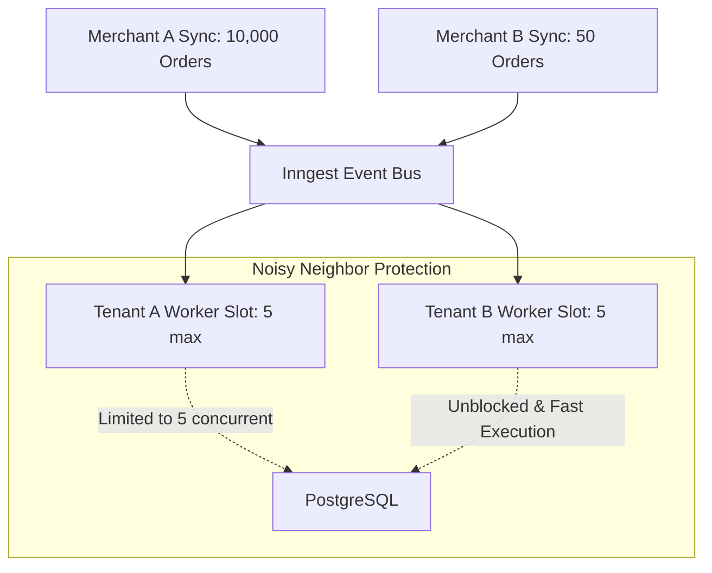

# Scalability Architecture & Performance Optimization

This document analyzes system bottlenecks, scalability guardrails, database indexing strategies, and concurrency patterns designed to scale the SaaS BI platform to millions of orders across thousands of Bangladeshi merchants.

---

## 1. Scalability Guardrails

The codebase adheres to the following non-negotiable performance principles:

| Guardrail | Enforcement Mechanism | Failure Consequence |
|---|---|---|
| **Zero N+1 Queries** | Use Prisma `include` or raw SQL aggregations; never fetch relations inside loops | Database CPU saturation |
| **Mandatory Indexing** | Composite indexes on all tenant foreign keys and filter predicates | Full table scans on `orders` |
| **Strict Pagination** | Default 20, hard maximum 100 on list endpoints | Memory exhaustion & OOM crashes |
| **Server Components** | Data fetched directly on edge/server runtime before rendering | Client waterfalls & layout shift |
| **Tenant Concurrency** | Inngest concurrency limited to 5 per tenant (`key: 'event.data.tenantId'`) | Noisy neighbor starving others |
| **SQL-First Analytics**| Standard KPIs computed in Postgres; LLMs reserved for natural language | Astronomical AI token bills |
| **LLM Caching** | SHA-256 deterministic cache in `ai_cache` (24h TTL) | Duplicate LLM invocations |
| **Connection Pooling** | Supavisor / pgBouncer transaction pooling on port 6543 | Postgres connection limit errors |

---

## 2. Database Bottlenecks & Optimization

### High-Volume Tables: `orders` and `order_status_history`

E-commerce order volume scales rapidly during promotional seasons (e.g., Eid campaigns, 11.11, Daraz Fatafati). A single store can generate 20,000+ orders during a peak week, with each order undergoing 4-6 status transitions.

#### Composite Index Strategy

The Prisma schema defines composite B-Tree indexes matching the query access patterns:

```prisma
model Order {
  // ...
  @@index([tenantId, createdAt(sort: Desc)])
  @@index([tenantId, status])
  @@index([tenantId, district])
  @@index([tenantId, trackingCode])
}
```

* **Timeline Queries**: Filtered by `tenantId` and sorted by `createdAt DESC` use an index scan directly without a temporary sorting step in memory (`Sort` operation eliminated in Postgres `EXPLAIN ANALYZE`).
* **District & Status Filtering**: The dashboard filter bar queries `[tenantId, status, district]` efficiently using composite indexes.

#### Long-Term Scale: Declarative Range Partitioning

When table sizes exceed 10 million rows, PostgreSQL declarative range partitioning by `created_at` (quarterly or monthly) will be introduced:

```sql
-- Architectural blueprint for scale > 10M rows:
CREATE TABLE orders_partitioned (
  id UUID NOT NULL,
  tenant_id UUID NOT NULL,
  created_at TIMESTAMPTZ NOT NULL,
  -- ... columns
  PRIMARY KEY (id, created_at)
) PARTITION BY RANGE (created_at);

CREATE TABLE orders_2026_q1 PARTITION OF orders_partitioned
  FOR VALUES FROM ('2026-01-01') TO ('2026-04-01');
```

---

## 3. Serverless Connection Pooling (Supavisor / pgBouncer)

Serverless functions on Vercel spin up independently, potentially exhausting PostgreSQL's maximum connection limit (typically 100-300 connections).

### Configuration Standard:
- **`DATABASE_URL`**: Routes to Supabase Supavisor pooler on port **6543** in **Transaction Pooling** mode. Every database transaction checks out a connection and immediately returns it to the pool upon completion.
- **`DIRECT_URL`**: Routes to direct Postgres port **5432**, used exclusively during Prisma schema migrations and initial RLS setup.

```typescript
// src/lib/prisma.ts singleton pattern prevents hot-reload connection leaks:
const globalForPrisma = globalThis as unknown as { prisma: PrismaClient | undefined };
export const prisma = globalForPrisma.prisma ?? new PrismaClient();
if (process.env.NODE_ENV !== 'production') globalForPrisma.prisma = prisma;
```

---

## 4. Background Job Concurrency (Inngest)



### Noisy-Neighbor Mitigation:
Without concurrency keys, a large merchant syncing 50,000 past orders would exhaust all background workers, causing smaller merchants' live courier webhooks to delay.

Inngest functions are configured with tenant-keyed limits:
```typescript
export const syncOrders = inngest.createFunction(
  {
    id: 'sync-orders',
    concurrency: {
      limit: 5,
      key: 'event.data.tenantId',
    },
    retries: 3,
  },
  { event: 'integration/orders.sync' },
  // ...
);
```

---

## 5. AI Cost & Latency Optimization

1. **Pre-computation over LLM Inference**:
   - `Total Revenue`, `AOV`, `Delivery Rate`, `Return Rate` are computed using database aggregate queries (`_sum`, `_avg`, `_count`).
   - Query latency: **~5-15ms** vs. **1500-3000ms** for an LLM. Cost: **$0.00** vs. **$0.005/call**.

2. **Deterministic SHA-256 Prompt Caching**:
   - Every natural language query computes: `SHA-256(tenantId + query.trim().toLowerCase() + dateBucket)`.
   - Results are cached in `ai_cache` for 24 hours. Repeating common queries ("How are returns in Chittagong?") has 0 token cost.

3. **Daily Token Cap & Rate Limiting**:
   - Hard cap of 100,000 tokens/tenant/day tracked in `ai_token_usage`.
   - Enforced by `aiService.checkQuota(tenantId, limit)` before dispatching API calls.
