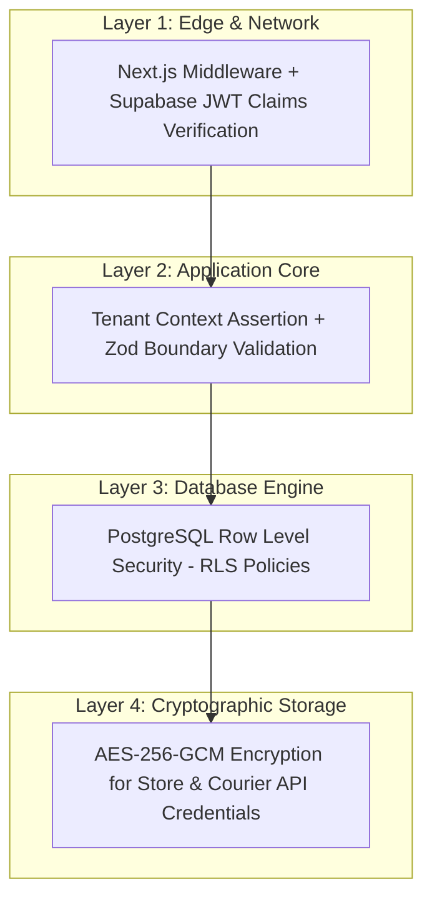

# Security Specification & Threat Model

This document outlines the multi-layered security architecture, cryptographic controls, Row Level Security (RLS) policies, and threat models for the SaaS BI Analytics Platform.

---

## 1. Security Philosophy: Defense in Depth

The platform enforces isolation and data protection across four distinct layers:



---

## 2. Threat Modeling & Mitigations

### Threat 1: Cross-Tenant Data Access (IDOR)
* **Risk**: An authenticated merchant manipulates `tenantId` query parameters or API payloads to read or modify another merchant's orders, analytics, or store secrets.
* **Mitigations**:
  1. **Zero Client Trust**: The client never provides its own `tenantId` authorization. The active tenant is extracted directly from the verified Supabase JWT claim.
  2. **Application Assertions**: `assertTenantAccess(sessionTenantId, requestedTenantId)` throws `UnauthorizedError` if any route receives mismatched parameters.
  3. **Database RLS**: Every table enforces PostgreSQL Row Level Security based on `current_tenant_id()`. Even if an application query omits `tenantId`, PostgreSQL drops unauthorized rows at the storage engine level.

### Threat 2: Credential Exfiltration (Database Breach)
* **Risk**: If read access to the database is compromised, third-party API credentials (WooCommerce keys, Shopify tokens, Pathao secrets) are leaked.
* **Mitigations**:
  1. No plaintext secrets: All sensitive credentials are encrypted using **AES-256-GCM** with a distinct initialization vector (IV) and authentication tag before storage in `stores.encrypted_api_secret` and `courier_credentials.encrypted_api_key`.
  2. The encryption key is held solely in memory at runtime via the `ENCRYPTION_KEY` environment variable.

### Threat 3: Forged Webhook & IPN Injection
* **Risk**: Attackers send fake order status changes or forged SSLCommerz IPN messages to falsely mark orders as delivered or mark subscriptions as paid.
* **Mitigations**:
  1. **WooCommerce**: Validates HMAC-SHA256 signature in `x-wc-webhook-signature`.
  2. **Shopify**: Validates HMAC-SHA256 signature in `x-shopify-hmac-sha256`.
  3. **Couriers**: Requires pre-shared bearer tokens or courier webhook secrets.
  4. **SSLCommerz IPN**: Validates `store_id`, verifies `verify_sign`, and double-checks transaction status with SSLCommerz transaction validation API before upgrading tenant subscription.
  5. **Audit Logging**: Every incoming webhook is recorded in `webhook_events` for forensics and replay detection.

### Threat 4: AI Prompt Injection & Token Exhaustion
* **Risk**: Malicious queries attempt to extract system prompts, inject rogue SQL, or consume unlimited LLM compute to incur financial loss.
* **Mitigations**:
  1. **Strict Cost Discipline**: Standard KPIs are computed with SQL, **never** LLMs.
  2. **Grounded SQL Context**: LLMs receive strictly formatted, aggregated data summaries without raw database access.
  3. **Deterministic SHA-256 Caching**: Identical queries from the same tenant hit the `ai_cache` table (24-hour TTL), consuming 0 LLM tokens.
  4. **Hard Daily Quotas**: Strict cap of 100,000 tokens/day per tenant (configurable per tier). Exceeding this triggers `QuotaExceededError` (HTTP 429).

---

## 3. Supabase Row Level Security (RLS) Implementation

All database tables have RLS enabled. Isolation is governed by the `current_tenant_id()` function:

```sql
CREATE OR REPLACE FUNCTION current_tenant_id()
RETURNS UUID AS $$
  SELECT NULLIF(current_setting('request.jwt.claims', true)::json->>'tenant_id', '')::UUID;
$$ LANGUAGE SQL STABLE SECURITY DEFINER;
```

### Table Policy Matrix

| Table | Policy Name | Permitted Roles | Condition |
|---|---|---|---|
| `tenants` | `tenant_isolation_select` | `authenticated` | `id = current_tenant_id()` |
| `users` | `user_tenant_select` | `authenticated` | `tenant_id = current_tenant_id()` |
| `stores` | `stores_tenant_all` | `authenticated` | `tenant_id = current_tenant_id()` |
| `courier_credentials` | `courier_creds_tenant_all` | `authenticated` | `tenant_id = current_tenant_id()` |
| `orders` | `orders_tenant_all` | `authenticated` | `tenant_id = current_tenant_id()` |
| `order_status_history` | `order_history_tenant_all` | `authenticated` | `tenant_id = current_tenant_id()` |
| `ai_cache` | `ai_cache_tenant_all` | `authenticated` | `tenant_id = current_tenant_id()` |
| `ai_token_usage` | `ai_tokens_tenant_all` | `authenticated` | `tenant_id = current_tenant_id()` |
| `subscriptions` | `subscriptions_tenant_all`| `authenticated` | `tenant_id = current_tenant_id()` |
| `webhook_events` | `webhooks_tenant_all` | `authenticated` | `tenant_id = current_tenant_id()` |

---

## 4. Cryptographic Standards

### AES-256-GCM Implementation (`src/lib/encryption.ts`)
- **Algorithm**: `aes-256-gcm`
- **Key Size**: 256 bits (32 bytes)
- **IV Size**: 128 bits (16 bytes) generated cryptographically random (`crypto.randomBytes(16)`) per encryption operation
- **Auth Tag**: 128 bits (16 bytes) ensuring tamper detection
- **Format**: `iv:authTag:ciphertext` (hex encoded)

---

## 5. Security Incident Response

In the event of a suspected security incident:
1. Rotate `ENCRYPTION_KEY` and re-encrypt all stored credentials.
2. Rotate `SUPABASE_SERVICE_ROLE_KEY` and update all server environments.
3. Review audit records in `webhook_events` and `order_status_history`.
4. Inspect Sentry exception alerts and structured warning logs.
