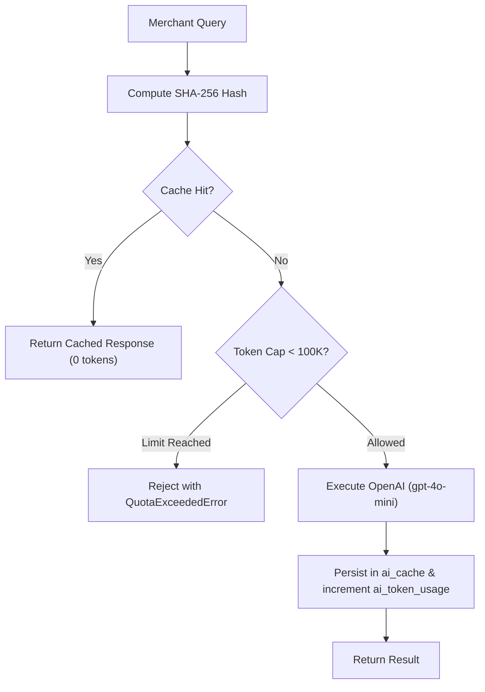

# AI Domain Module (`/src/modules/ai`)

## 1. Purpose & Responsibilities
- Natural language query interface allowing merchants to query sales, returns, and courier metrics in plain language.
- Automated anomaly detection flagging sudden drops in delivery fulfillment or spikes in returns.
- **Cost Discipline**: Hard cap of 100,000 tokens/day per tenant with SHA-256 prompt response caching in `ai_cache` (24h TTL).

## 2. Public API Surface (`index.ts`)
- `aiService.executeQuery(tenantId, query, contextSummary): Promise<AiQueryResult>`
- `aiService.checkQuota(tenantId, dailyLimit): Promise<AiUsageStatus>`
- `aiService.computePromptHash(tenantId, query, contextHash): string`
- `QuotaExceededError`: Thrown when tenant daily limit is reached.
- Schemas: `askAiQuerySchema`.

## 3. Data Flow Diagram

## 4. Environment Variables Required
- `DATABASE_URL`
- `OPENAI_API_KEY`

## 5. Testing Strategy
- Unit tests for prompt hash stability and daily token quota enforcement (`ai.test.ts`, `ai_engine.test.ts`).

## 6. Known Limitations
- When `OPENAI_API_KEY` is not present, deterministic mock heuristic responses are returned for development safety.

