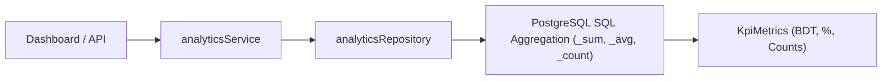

# Analytics Domain Module (`/src/modules/analytics`)

## 1. Purpose & Responsibilities
- Computes standard e-commerce business metrics: Total Gross Revenue, AOV (Average Order Value), Delivery Success Rate, Return / RTO Rate, and COD Cash Flow Reconciliation.
- **SQL-First Performance**: Pre-computes and aggregates metrics using PostgreSQL database indexes — zero LLM calls are made for standard mathematical operations.

## 2. Public API Surface (`index.ts`)
- `analyticsService.getDashboardKpis(tenantId, timeframe): Promise<KpiMetrics>`
- Types: `KpiMetrics`, `AnalyticsTimeframe`, `CourierPerformanceMetric`, `DistrictDeliveryMetric`.
- Schemas: `analyticsQuerySchema`.

## 3. Data Flow Diagram

## 4. Environment Variables Required
- `DATABASE_URL`

## 5. Testing Strategy
- Unit tests for KPI calculations and financial accuracy.
