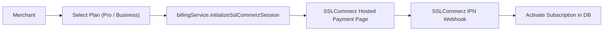

# Billing Domain Module (`/src/modules/billing`)

## 1. Purpose & Responsibilities
- Subscription tier management (Free, Pro, Business).
- Usage limits enforcement (monthly orders, connected stores, daily AI tokens).
- Payment gateway integration via SSLCommerz redirect flow (zero handling of merchant funds).

## 2. Public API Surface (`index.ts`)
- `billingService.getSubscriptionInfo(tenantId): Promise<SubscriptionInfo>`
- `billingService.checkOrderQuota(tenantId, count): Promise<boolean>`
- `billingService.initializeSslCommerzSession(params): Promise<SslCommerzSessionResponse>`
- `PLAN_CONFIG`: Plan limits dictionary.
- Schemas: `upgradePlanSchema`, `sslCommerzIpnSchema`.

## 3. Data Flow Diagram

## 4. Environment Variables Required
- `DATABASE_URL`
- `SSLCOMMERZ_STORE_ID`
- `SSLCOMMERZ_STORE_PASSWORD`
- `SSLCOMMERZ_IS_SANDBOX`

## 5. Testing Strategy
- Unit tests for plan quota validation and SSLCommerz redirect URL generation (`billing.test.ts`, `billing_routes.test.ts`).

## 6. Known Limitations
- SSLCommerz sandbox mode is simulated in local development environments when valid sandbox credentials are not provisioned.

