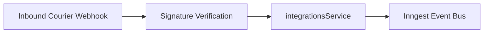

# Integrations Domain Module (`/src/modules/integrations`)

## 1. Purpose & Responsibilities
- Connectors for e-commerce platforms (WooCommerce REST API v3, Shopify OAuth).
- Connectors for Bangladeshi couriers (Pathao, Steadfast, RedX).
- Encrypted credential storage and HMAC/Signature verification for webhook payloads.

## 2. Public API Surface (`index.ts`)
- `integrationsService.getTenantStores(tenantId): Promise<StoreSummary[]>`
- `integrationsService.getTenantCouriers(tenantId): Promise<CourierCredentialSummary[]>`
- `integrationsRepository`: Scoped store and courier data access.
- Schemas: `connectWooCommerceSchema`, `connectShopifySchema`, `configureCourierSchema`.

## 3. Data Flow Diagram

## 4. Environment Variables Required
- `DATABASE_URL`
- `ENCRYPTION_KEY`

## 5. Testing Strategy
- Unit tests for courier status mapping (`courier_normalizer.test.ts`).
- Connector HMAC and signature verification tests (`woocommerce_connector.test.ts`, `shopify_connector.test.ts`, `webhooks.test.ts`).

## 6. Known Limitations
- Background webhook retry backoff is handled upstream by Inngest; dropped webhooks without courier retry will be caught by the periodic reconciliation poller.

