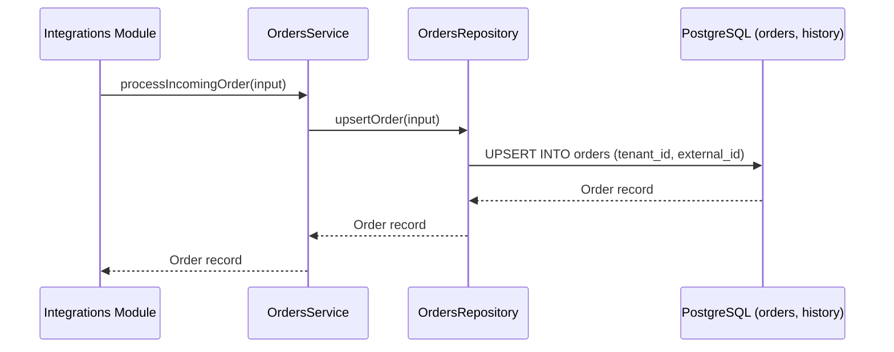

# Orders Domain Module (`/src/modules/orders`)

## 1. Purpose & Responsibilities
- Unified order ingestion from multiple platforms (WooCommerce, Shopify).
- Courier tracking code association (Pathao, Steadfast, RedX).
- Order status state transitions and immutable audit timeline logging in `order_status_history`.
- Paginated, indexed search across order numbers, customer phones, and districts.

## 2. Public API Surface (`index.ts`)
- `ordersService.getOrders(tenantId, params): Promise<PaginatedOrdersResult>`
- `ordersService.getOrderDetails(tenantId, orderId): Promise<OrderWithHistory | null>`
- `ordersService.processIncomingOrder(input: CreateOrderInput): Promise<Order>`
- `ordersService.updateCourierStatus(tenantId, orderId, newStatus, rawCourierStatus, source, note)`
- Types: `NormalizedOrderStatus`, `OrderFilterParams`, `PaginatedOrdersResult`, `CreateOrderInput`.
- Schemas: `orderFilterSchema`, `updateOrderStatusSchema`.

## 3. Data Flow Diagram

## 4. Environment Variables Required
- `DATABASE_URL`

## 5. Testing Strategy
- Unit tests for order status updates and idempotency.
- Filter schema validation tests.

## 6. Known Limitations
- CSV export capability is planned for Phase 3.
