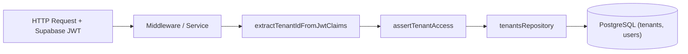

# Tenants Domain Module (`/src/modules/tenants`)

## 1. Purpose & Responsibilities
- Manages multi-tenant workspaces, team member invitations, and tenant lifecycle.
- Provides cryptographic tenant boundary enforcement and Supabase JWT claim parsing.
- Guarantees zero cross-tenant horizontal privilege escalation.

## 2. Public API Surface (`index.ts`)
- `extractTenantIdFromJwtClaims(claims: unknown): string | null`
- `assertTenantAccess(sessionTenantId: string, requestedTenantId: string): void`
- `getTenantSummary(tenantId: string, userId: string): Promise<TenantSummary | null>`
- `tenantsRepository`: Scoped database access for tenant models.
- Schemas: `createTenantSchema`, `inviteMemberSchema`.

## 3. Data Flow Diagram

## 4. Environment Variables Required
- `DATABASE_URL`
- `NEXT_PUBLIC_SUPABASE_URL`
- `NEXT_PUBLIC_SUPABASE_ANON_KEY`

## 5. Testing Strategy
- Unit tests in `tests/unit/rls_isolation.test.ts` verifying JWT extraction and access denial.
- Schema tests in `tests/unit/auth.test.ts`.

## 6. Known Limitations
- Team member invitations currently send links; email dispatch via Resend/SendGrid will be integrated in Phase 5.
